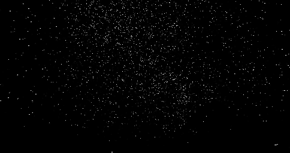

# Motion Detection Program
The Motion Detection Program is a multi-functional application that processes video files to detect motion. It features capabilities such as video-to-frame extraction, frame-based motion detection, and frame-to-video conversion. The program also supports server-client modes for distributed processing.

## Features
- Convert video files into individual frames (JPEG format).
- Detect motion between consecutive frames and highlight motion areas.
- Reconstruct frames into a video file.
- Multithreaded processing for efficiency.
- Server-client communication for distributed motion detection.

## Original Video


Source: https://www.youtube.com/watch?v=dQ7Z1YOp9TI
## After Motion Detection


## File Structure
- **`main.c`**: Entry point providing a menu-driven interface.
- **`handle_motion.c`**: Handles motion detection logic, including multithreading.
- **`image_utils.c`**: Utilities for image processing, such as grayscale conversion and saving/loading images.
- **`network_utils.c`**: Implements server-client communication for distributed motion detection.
- **`vid_to_jpg.cpp`**: Extracts frames from video files using OpenCV.

## Prerequisites
- **C Compiler**: GCC or equivalent.
- **C++ Compiler**: G++ for integrating OpenCV functionality.
- **Libraries** (Install via package manager or build from source):
  - OpenCV (`libopencv`):
    ```bash
    sudo apt-get install libopencv-dev
    ```
  - libjpeg:
    ```bash
    sudo apt-get install libjpeg-dev
    ```

## Compilation and Usage
To compile the program, use the provided `Makefile`. Ensure you have all required dependencies installed. Run the compiled executable and follow the menu prompts:

```bash
make
```
```bash
./motion_detect
```

## Menu Options
1. Convert video to frames: Extracts individual frames from a video file.
2. Perform motion detection on frames: Detects motion and saves motion-highlighted frames.
3. Convert frames to video: Reconstructs processed frames back into a video file.
4. Run as server: Starts the program in server mode for distributed motion detection.
5. Run as client: Connects to the server to perform distributed motion detection tasks.
6. Exit: Exits the program.

## Frame Processing Details
Each frame is processed to detect motion through the following steps:

1. **Loading the Frame**:
   A frame is loaded using `load_jpeg`:
   ```c
   unsigned char* frame = load_jpeg(frame_path, &width, &height);
   ```
   This function reads a JPEG file and returns its pixel data as an array of unsigned bytes.

2. **Grayscale Conversion**:
   The frame is converted to grayscale to simplify motion detection:
   ```c
   void rgb_to_grayscale(const unsigned char* rgb, unsigned char* gray, int width, int height) {
       for (int i = 0; i < width * height; ++i) {
           int r = rgb[3 * i];
           int g = rgb[3 * i + 1];
           int b = rgb[3 * i + 2];
           gray[i] = (r * 0.3 + g * 0.59 + b * 0.11);
       }
   }
   ```
   This uses weighted averages of the RGB values to calculate the grayscale intensity.

3. **Frame Difference Calculation**:
   To detect motion, the difference between two consecutive grayscale frames is calculated:
   ```c
   void compute_difference(const unsigned char* frame1, const unsigned char* frame2, unsigned char* diff, int width, int height) {
       for (int i = 0; i < width * height; ++i) {
           diff[i] = abs(frame1[i] - frame2[i]);
       }
   }
   ```
   This generates a difference map highlighting areas with motion.

4. **Threshold Application**:
   A binary threshold is applied to isolate significant motion areas:
   ```c
   void apply_threshold(const unsigned char* diff, unsigned char* binary, int width, int height, unsigned char threshold) {
       for (int i = 0; i < width * height; ++i) {
           binary[i] = (diff[i] > threshold) ? 255 : 0;
       }
   }
   ```
    This loop processes each pixel in the frame:
    - Compare the difference value (`diff[i]`) to the threshold.
    - Assign 255 if it exceeds the threshold, otherwise assign 0.
    - Store the result in the `binary` array.

5. **Saving the Frame**:
   The processed frame is saved as a binary or grayscale image:
   ```c
   save_jpeg(output_path, binary_frame, width, height);
   ```
   This writes the binary data back to a JPEG file.

## Notes
- Use `home` during prompts to return to the main menu.
- Ensure all directories and files are accessible.

## Authors
- Cade Andrae